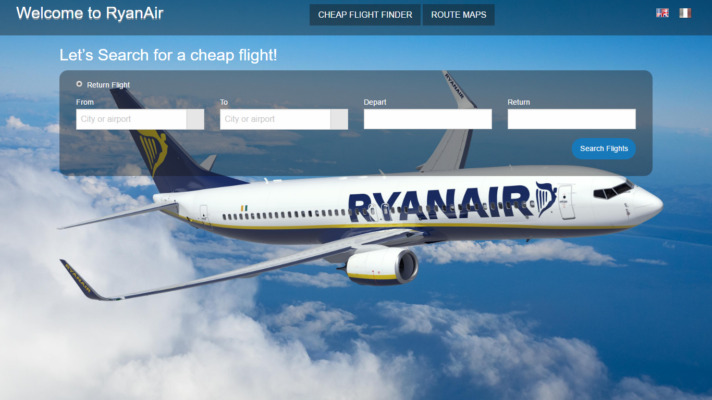
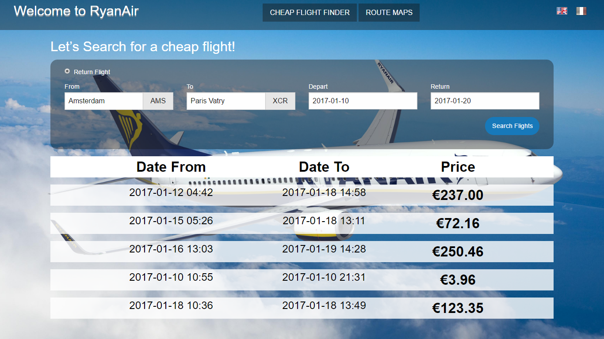
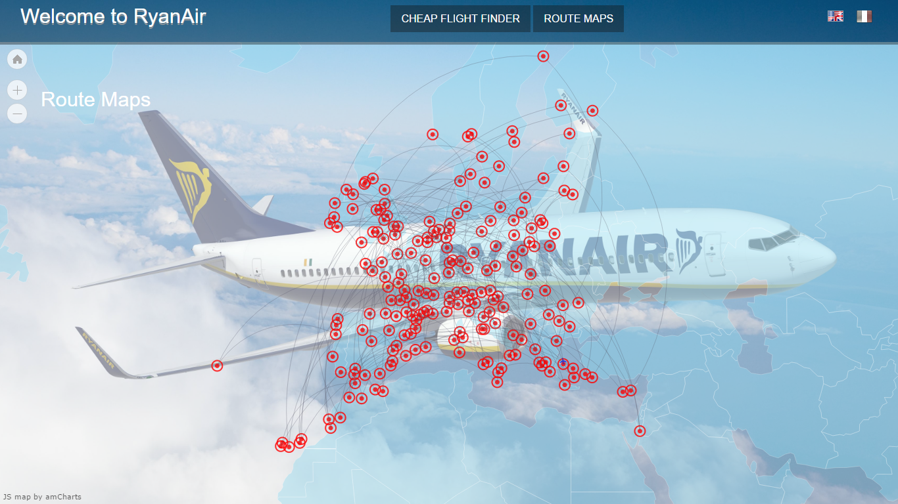
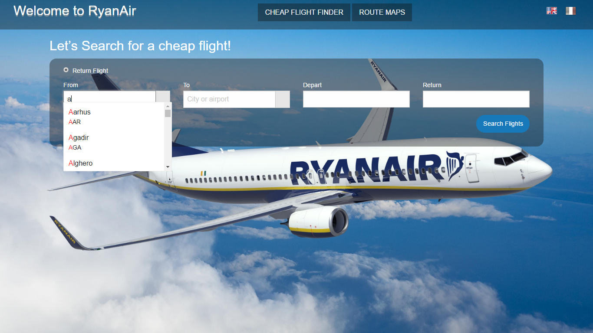
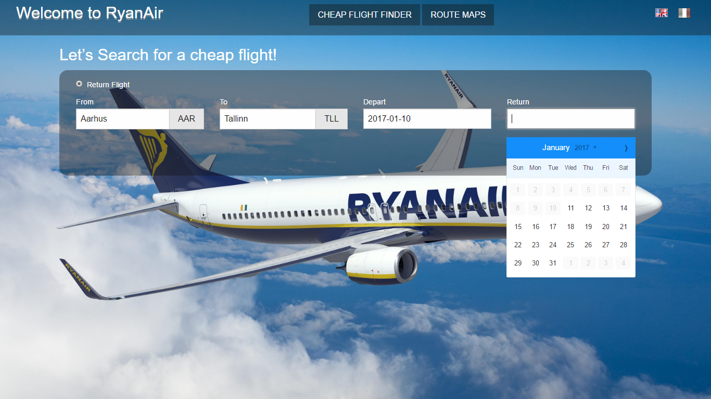
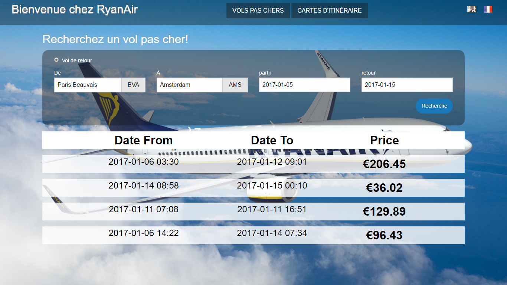
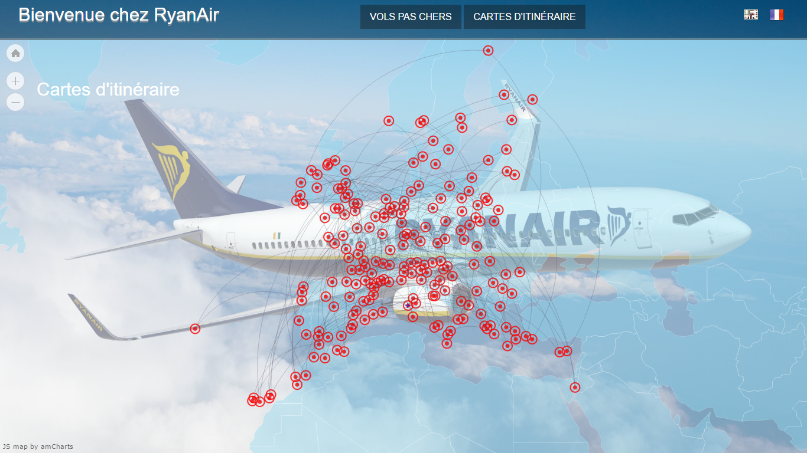

# [DEMO](https://securedeveloper.github.io/ryanair-developer-test-web-app/)

## NOTE 

Please update link of `<base href="https://securedeveloper.github.io/ryanair-developer-test-web-app/" />` before running this project.
usually you are required to set it to your localserver or hosted server path, in my case if was `<base href="http://localhost:88/" />`.

# RyanAir Developer Test Web App 

[](mailto://securedeveloper@gmail.com)

To accomplish this task, I have used following technologies : 

  - Angular JS 1
  - Foundation
  - SCSS, CSS

# Task Description
### Tast 01 - Cheap flight finder
I have :
 - buit a form through which user can enter two route places (source & destination)
 - Implemented autocomplete functionality on place inputs
 - Impleted datepicker on date selection inputs
- Implemented error handling on search form
- On search button press, Flights are searched through API request, and are displayed as list.

### Tast 02 - Route maps

I've used amcharts api to accomplish route maps task:
  - [amcharts](https://www.amcharts.com/)
  - I got list of all airports through API provided, and then I pass them to amchart library to render a nice routes map.

### Tast 03 - Translations

I used [](https://www.mongodb.com/) to create two different files
 - `en.json` for English version
 - `fr.json` for French Versio
There are two flags for `english` and `french` version, by pressing on each button site it converted to relevant language.

### .htaccess file

Please make sure that you have `.htaccess` file in root directory before running this application.

```c
<IfModule mod_rewrite.c>

RewriteEngine On
RewriteCond %{REQUEST_FILENAME} !-f 
RewriteCond %{REQUEST_FILENAME} !-d 
RewriteCond %{REQUEST_FILENAME} !-l

RewriteRule .* index.html [L]

</IfModule>
```

# Screenshots

### Simple Layout - English Version

### Flight Search - English Version

### Route Maps - English Version
Map is Zoomable, You can use cursor to navigate on map as well.


### Autocomplete - English Version

### Datepicker - English Version 
Restriction are applied on date selection.


### Simple Layout - French Version

### Flight Search - French Version

### Route Maps - French Version


For any further query. Please write me at `securedeveloper@gmail.com`.
